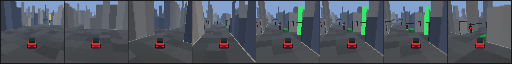
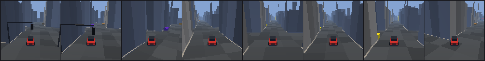
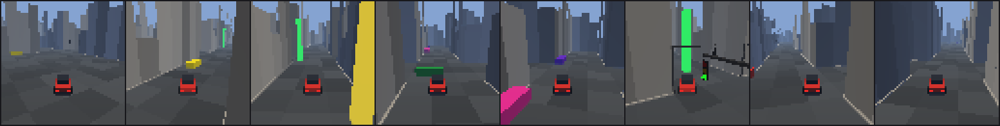
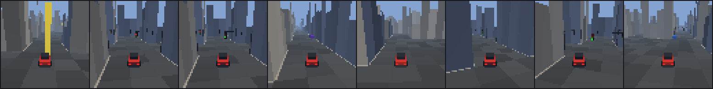
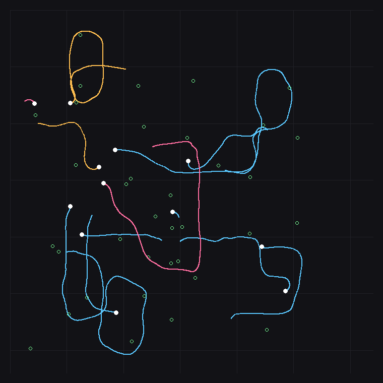
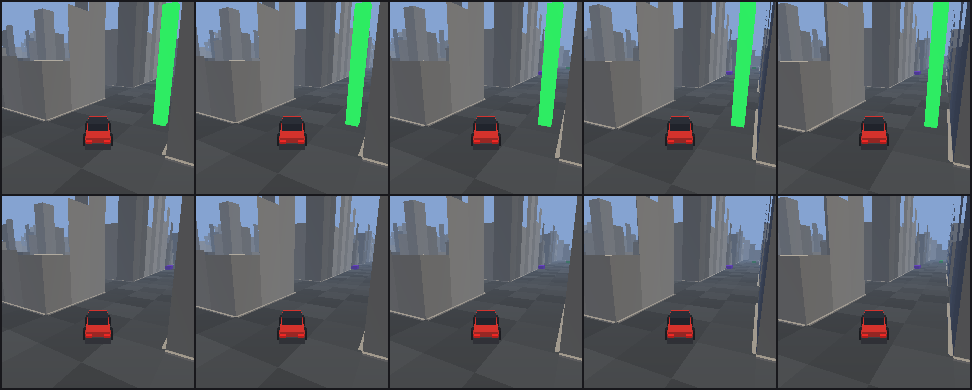

# LeWM pilot dataset report

- **dataset**: `/home/ubuntu/lewm_runs/pilot_001`
- **collected**: 2026-10-04T12:42:10  (git `0bed181e26`)
- **schema version**: 2
- **episodes**: 12 (test 2/train 8/val 2)
- **transitions**: 5492
- **observation mode**: `vector_full`; captured: vector=True, rgb=True, privileged=True
- **validation**: PASSED (37/37 checks)

> Stage 0 pilot: instrumentation check, not a training dataset.

## 1. Status against the brief

Stage 0 only. This is an instrumentation check, **not** a training dataset: 12 episodes and 5492 transitions are orders of magnitude short of what the brief's stage 1 asks for, and no model has been trained on it. What it establishes is that the recorded trajectories are correct -- aligned, reproducible, complete and separated from the privileged state -- so that scaling up is a matter of changing three episode counts.

## 2. Validation

|  | check | detail |
|---|---|---|
| PASS | every manifest episode exists on disk |  |
| PASS | every episode on disk is in the manifest |  |
| PASS | episode ids are unique |  |
| PASS | train/val/test episode sets are disjoint | test=2 / train=8 / val=2 |
| PASS | episode seeds are unique across the dataset |  |
| PASS | no environment seed is shared between splits |  |
| PASS | observation-side records are action-side + 1 |  |
| PASS | timesteps are contiguous from 0 |  |
| PASS | trajectory lengths are within the episode limit | T: min 42 median 311 max 1000 |
| PASS | terminated/truncated only on the final step and consistent with `reason` |  |
| PASS | no NaN/Inf in observations, actions, rewards or ground truth |  |
| PASS | every episode carries the arrays its config promises | timestep action reward terminated truncated obs_vector rgb privileged |
| PASS | obs[t] + action[t] -> obs[t+1] reproduces the car model | max pose residual 1.87e-05 m over 12 episodes (tol 2e-03) |
| PASS | no off-by-one: shifting the actions by one step breaks it | shifted residual 8.10e-02 m vs aligned 1.87e-05 m (4323x) |
| PASS | replaying stored actions from the stored seed reproduces the episode (3 sampled) | vector bit-identical; 1/1260 frames with any pixel difference, worst 5/255 (rasteriser tie-breaks, tolerance 8/255 over 0.1% of pixels) |
| PASS | RGB frames decode with one consistent shape and dtype | [(64, 64, 3, 'uint8')]  (5504 frames) |
| PASS | camera configuration is identical across the dataset | 1 distinct configs |
| PASS | goal-beacon setting is identical across the dataset | show_goal_beacon=[True] |
| PASS | no flat/corrupt frames |  |
| PASS | frames change while the car is moving (ordering/staleness) |  |
| PASS | actions are inside the action space [-1, 1] | range -1.000 .. 1.000 |
| PASS | no action channel is degenerate (constant) | throttle sd=0.334  brake sd=0.737  steer sd=0.476 |
| PASS | steering is exercised in both directions | steer -1.00 .. 1.00 |
| PASS | the brake channel spans both ends of its range | brake 0.00 .. 1.00 (mean 0.20) |
| PASS | the throttle reaches full forward | throttle -0.58 .. 1.00 (reverse steps: 242) |
| PASS | speed distribution is non-degenerate | sd 3.38 m/s |
| PASS | per-step displacement is physically plausible | max 0.699 m (limit = max_speed * dt) |
| PASS | covered: stationary (<0.5 m/s) | 951/5504 = 17.3%  (floor 0.1%) |
| PASS | covered: low speed (0.5-3 m/s) | 401/5504 = 7.3%  (floor 1.0%) |
| PASS | covered: mid speed (3-10 m/s) | 4005/5504 = 72.8%  (floor 10.0%) |
| PASS | covered: high speed (>10 m/s) | 147/5504 = 2.7%  (floor 2.0%) |
| PASS | covered: straight (\|yaw rate\| < 0.05) | 1446/5504 = 26.3%  (floor 5.0%) |
| PASS | covered: turning (\|yaw rate\| > 0.2) | 2809/5504 = 51.0%  (floor 5.0%) |
| PASS | covered: braking (accel < -1) | 823/5504 = 15.0%  (floor 2.0%) |
| PASS | covered: accelerating (accel > 1) | 1458/5504 = 26.5%  (floor 2.0%) |
| PASS | covered: off-nominal (injected) | 37/5492 = 0.7%  (floor 0.0%) |
| PASS | the dataset contains crashes as well as clean driving | crash steps: 8 |

The two checks that carry the weight are the replay check -- re-running the stored actions from the stored seed must reproduce the stored observations bit-for-bit -- and the forward-dynamics residual, which integrates the recorded pose one step with the recorded action and the car's own kinematic model, then does it again with the actions shifted by one step. The aligned residual is at float32 noise and the shifted one is thousands of times larger, which is what makes `obs[t] + action[t] -> obs[t+1]` a measured property rather than a claim in a docstring.

## 3. Dataset composition

| policy profile | target share | episodes |
|---|---|---|
| aggressive | 25% | 3 |
| competent | 25% | 3 |
| conservative | 20% | 2 |
| intermediate | 10% | 1 |
| noisy_competent | 15% | 2 |
| recovery | 5% | 1 |

| episode ending | count |
|---|---|
| crash | 8 |
| success | 2 |
| timeout | 2 |

Episode length: min 42, median 311, mean 458, max 1000 steps (23 s of simulated driving on average).
Waypoints reached: 11; crash steps: 8; injected off-nominal steps: 37.

## 4. Behavioural coverage

| regime | steps | share | floor |
|---|---|---|---|
| stationary (<0.5 m/s) | 951 | 17.3% | 0.1% |
| low speed (0.5-3 m/s) | 401 | 7.3% | 1.0% |
| mid speed (3-10 m/s) | 4005 | 72.8% | 10.0% |
| high speed (>10 m/s) | 147 | 2.7% | 2.0% |
| straight (\|yaw rate\| < 0.05) | 1446 | 26.3% | 5.0% |
| turning (\|yaw rate\| > 0.2) | 2809 | 51.0% | 5.0% |
| braking (accel < -1) | 823 | 15.0% | 2.0% |
| accelerating (accel > 1) | 1458 | 26.5% | 2.0% |
| off-nominal (injected) | 37 | 0.7% | 0.0% |
| recovery (25 steps after a burst) | 75 | 1.4% | - |

## 5. Dynamics

| quantity | min | mean | max | sd |
|---|---|---|---|---|
| speed | -0.09 | 5.55 | 13.98 | 3.38 |
| accel | -10.51 | 0.28 | 4.93 | 2.54 |
| steer_angle | -0.56 | 0.01 | 0.56 | 0.26 |
| yaw_rate | -1.74 | -0.03 | 2.23 | 0.48 |

| action channel | min | mean | max | sd |
|---|---|---|---|---|
| throttle | -0.58 | 0.30 | 1.00 | 0.33 |
| brake | -1.00 | -0.60 | 1.00 | 0.74 |
| steer | -1.00 | 0.02 | 1.00 | 0.48 |

## 6. Throughput

| configuration | steps/s | env.reset (ms) | KiB/step | steps measured |
|---|---|---|---|---|
| env.step only (constant action) | 671 | 33 | - | 500 |
| + scripted policy | 550 | 33 | - | 500 |
| + vector recording | 542 | 33 | 0.3 | 500 |
| + RGB capture | 376 | 59 | 12.4 | 500 |
| + privileged state | 370 | 59 | 12.7 | 500 |

Cumulative: each row adds one cost to the row above it, so the differences are attributable.

The scripted driver, not the simulator, is what a vector-only collection spends its time on: 671 steps/s for `env.step` alone against 550 with the controller in the loop. Recording on top of that is nearly free.

RGB capture costs 1.5x in wall-clock. At the measured 370 steps/s, one million RGB transitions is about 0.8 h in a single process and 13 GB on disk uncompressed -- the number that decides the size of the real collection, and the reason the seed plan was written to be shardable by split and episode index (each episode's seeds are a pure function of `(environment_seed, split, index)`, so N processes can each take a stride without coordinating).

The pilot itself wrote 71.5 MB (12.7 KiB/transition) in 16 s.

## 7. Sample frames

What the pixel view actually contains, upscaled nearest-neighbour from the recorded 64x64 frames -- not re-rendered at a higher resolution, because the point is to show what a model would be trained on.

## 8. Goal beacon (brief section 11)

Measured by capturing every step twice, flipping `show_goal_beacon` between the two captures of the *same* simulator state, over 800 steps of competent driving:

- the beacon changes at least one pixel in **28.0%** of steps
- when visible it covers **0.80%** of the frame on average, at most 5.37%

Top row: `show_goal_beacon=True` (the default, and what every existing checkpoint and screenshot was produced with). Bottom row: the same states with the posts hidden. The columns are the frames where the beacon is *most* visible, not a fixed sample -- a fixed sample produces five identical-looking pairs, which is itself the finding.

Interpretation: waypoints are sampled 40-110 m from the previous one (`target_min_dist`/`target_max_dist`, so the chain reaches ~180 m from the spawn) and the city's buildings are 6-24 m tall, so the posts are occluded for most of a run and only appear once the car is on the right street. So the beacon is not a free answer to the whole navigation problem -- but it is a strong local cue exactly when the goal is nearly reached, which is the part of the task a pixel world model would most plausibly shortcut. That is an argument for collecting the beacon-off control (`--no-beacon`), not a reason to skip it: the switch exists and the two datasets differ in nothing else.

## 9. What this pilot does not establish

- Nothing has been trained. Dataset *correctness* is checked; dataset *sufficiency* for learning a world model is not, and cannot be without a training run.
- The city is procedural but the map distribution is fixed by `CityConfig`; this pilot varies the seed, not the generator.
- 12 episodes cannot establish the tail: rare events (red-light violations, pedestrian conflicts, reverse manoeuvres) appear a handful of times at most, so their frequency here says nothing about their frequency at scale.

